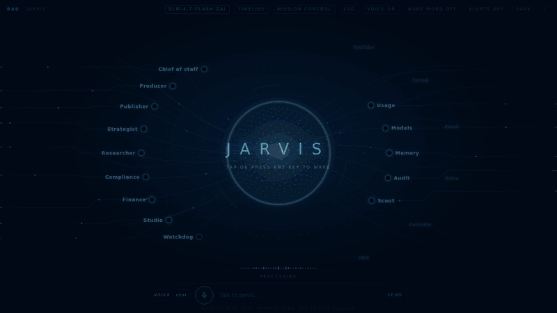
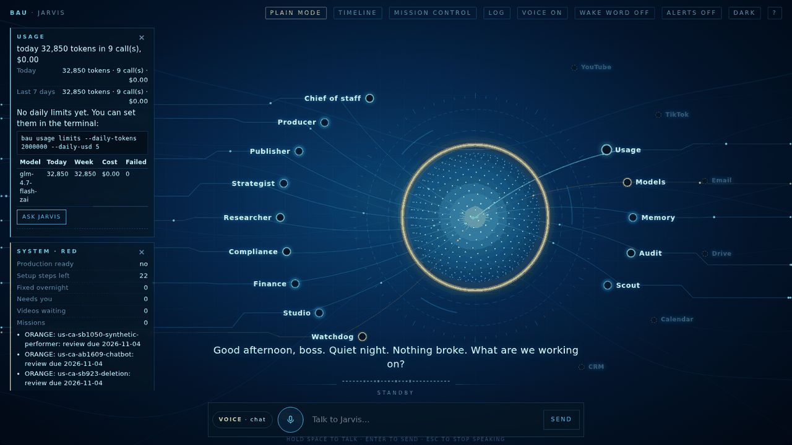
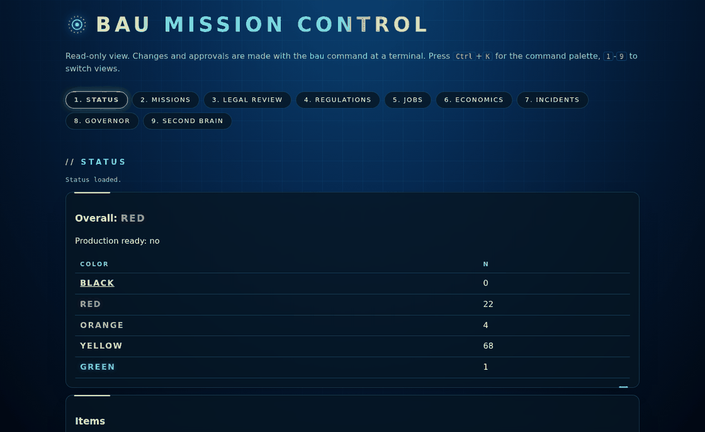

<div align="center">

<picture>
  <source media="(prefers-color-scheme: dark)" srcset="assets/hero-dark.svg">
  
</picture>



<p>
  <a href="https://github.com/BSAJabo258/linux-ai-biz/actions/workflows/ci.yml"></a>
  
  
  
  <a href="LICENSE"></a>
</p>

**[Quick start](#quick-start)** · **[Jarvis](#meet-jarvis)** · **[How it works](#how-it-works)** · **[Where it runs](#where-it-runs)** · **[Docs](#documents)**

</div>

---

BAU/BSA is an AI business system for one owner. AI agents do the work, a rule engine checks it
against the law, and **you** decide anything that matters. Before BAU sends an email, texts
someone, publishes generated media, sells a subscription, monetizes an asset or moves money, it:

1. finds which rules apply **on that date, in that place**;
2. decides **PASS / REVIEW / BLOCK**;
3. records the evidence in a **tamper-evident audit chain**.

<picture>
  <source media="(prefers-color-scheme: dark)" srcset="assets/features-dark.svg">
  
</picture>

<picture>
  <source media="(prefers-color-scheme: dark)" srcset="assets/stats-dark.svg">
  
</picture>

> [!IMPORTANT]
> BAU never claims to be "compliant" or "legally protected" (spec §121). It reports which
> requirements it identified, which controls ran, what evidence exists, and what is
> unresolved. Every regulation ships **awaiting counsel sign-off**, so nothing gets a clean
> PASS until a qualified human reviews it.

<picture>
  <source media="(prefers-color-scheme: dark)" srcset="assets/divider-dark.svg">
  
</picture>

## Meet Jarvis

Jarvis is the front door: a spoken briefing, conversation, and a live map of the business.
Each node is a part of the team (producer, scout, studio, watchdog and more) and lights up while
it works. Jarvis can look things up, draft and price things, but anything with consequences is
only **staged**: it runs when you press **Confirm**.

<details>
<summary><b>Still picture</b></summary>

</details>

### At the terminal

<picture>
  <source media="(prefers-color-scheme: dark)" srcset="assets/terminal-dark.svg">
  
</picture>

<picture>
  <source media="(prefers-color-scheme: dark)" srcset="assets/divider-dark.svg">
  
</picture>

## How it works

```mermaid
flowchart LR
    You(["👤 You"]) -->|ask, by voice or text| J["Jarvis"]
    J -->|tools| T["Agents · Toolbox · Studio · Scout"]
    T -->|every action| PRule engine<br/>PASS · REVIEW · BLOCK
    P -->|REVIEW / consequential| C["Staged for you"]
    C -->|your Confirm or SSH-signed approval| A["Action runs"]
    P -->|PASS| A
    P -->|BLOCK| X["Stopped, with the reason"]
    A --> L[("Audit chain<br/>tamper-evident")]
    G["Governor / watchdog"] -.->|can HOLD, never approves| T
    U["Usage meter"] -.->|tokens and dollars, your daily limits| J
```

<picture>
  <source media="(prefers-color-scheme: dark)" srcset="assets/divider-dark.svg">
  
</picture>

## Where it runs

| | Where | Guide |
|---|---|---|
| 💻 | **Encrypted laptop** from two USB sticks: hardened Debian + BAU | [docs/INSTALL.md](docs/INSTALL.md) |
| 🔑 | **Live USB**: boot any PC from one stick, encrypted storage, local model | [docs/LIVE-USB.md](docs/LIVE-USB.md) |
| ☁️ | **Your own cloud server** (DigitalOcean): Jarvis always on, reached through a private SSH tunnel | [docs/CLOUD-VM.md](docs/CLOUD-VM.md) |
| 🧪 | **Free test drive** in GitHub Codespaces with a free hosted model | [docs/CLOUD-TEST.md](docs/CLOUD-TEST.md) |

> [!TIP]
> A codespace can be deleted with everything in it. For the real business, use the laptop
> or your own cloud server: [docs/CLOUD-VM.md](docs/CLOUD-VM.md) sets one up in about 30 minutes.

<details>
<summary><b>Everything inside</b></summary>

- a **USB installer** that turns a laptop into an encrypted, hardened Debian machine;
- the **BAU control plane**, where compliance is part of the machine rather than a document beside it;
- the **work layers** that run on top of it:
  - Jarvis missions, agents and the model router (Claude, local llama.cpp, hosted models with backups);
  - MAYA memory, the Second Brain and Project Genesis;
  - the video studio, media, music-video and public-data spatial tools (God's Eye);
  - the toolbox, Repo Scout and the usage meter;
  - six business factories and the Opportunity Miner;
  - economics, accounting and sanctions screening;
  - a keyboard-first Mission Control dashboard.

</details>

<picture>
  <source media="(prefers-color-scheme: dark)" srcset="assets/divider-dark.svg">
  
</picture>

## Quick start

```bash
python3 -m pip install -e '.[dev]'
bau init                                   # BAU_HOME (default ~/.bau, or /var/lib/bau when installed)
bau reg validate                           # 49 regulations, 65 policies, all cross-references resolve
bau status --brief                         # honest production-readiness dashboard
bau email preflight --message m.json --recipients r.json --sender s.json --evidence
bau mission plan launch_subscription "Launch planner subscription" --facts facts.yaml
bau genesis import ~/exports/conversations.json && bau genesis extract --to-memory
bau factory list                           # six factories, all inactive until you approve
bau ui                                     # Mission Control on http://127.0.0.1:8765
python3 -m pytest -q                       # full test suite
```

To use Claude models: `pip install 'bau[claude]'`, sign in (`ant auth login` or `ANTHROPIC_API_KEY`), then approve the model yourself: `bau set-status model claude-opus-5-5 APPROVED`. For the offline laptop install, use `installer/make-payload.sh --with-claude`.

## My Jarvis live USB (boot and run from one stick)

```bash
bash image/build-live.sh                     # Debian 13 live system + BAU + llama.cpp -> dist/my-jarvis-*.iso
```

Write the ISO to a USB stick (balenaEtcher, or Rufus in DD mode), start any 8 GB PC from it, and follow **[docs/LIVE-USB.md](docs/LIVE-USB.md)**: encrypted storage on the stick, a small local model you approve, Jarvis. How the *My Jarvis OS* spec maps onto this repository, and the build order: **[docs/MY-JARVIS.md](docs/MY-JARVIS.md)**.

## Install on the laptop (two USB sticks)

```bash
installer/make-payload.sh --to /media/$USER/USB2         # USB #2: BAU payload + pre-wipe tools
installer/build-usb-image.sh                             # USB #1: verified Debian + BAU preseed
sudo installer/write-usb.sh dist/bau-debian-*.iso /dev/sdX
```

Then follow **[docs/INSTALL.md](docs/INSTALL.md)** in order: audit, backup and verify, wipe gate, install the OS, install BAU.

## Documents

| Document | What it is |
|---|---|
| [docs/SPEC_GAP_ANALYSIS.md](docs/SPEC_GAP_ANALYSIS.md) | Loose ends, contradictions and missing laws found in the master spec, and how each was resolved (spec v1.1 amendments) |
| [docs/EMAIL_AND_MESSAGING_COMPLIANCE.md](docs/EMAIL_AND_MESSAGING_COMPLIANCE.md) | The exact order every commercial email and marketing text goes through, and what you must set up |
| [docs/REGULATORY_STATUS.md](docs/REGULATORY_STATUS.md) | What changed in the law through 2026-10-04, with sources |
| [docs/INSTALL.md](docs/INSTALL.md) | Phase-by-phase install runbook |
| [docs/VM-USB-PLAN.md](docs/VM-USB-PLAN.md) | Test gates and rehearsal plan for the full OS and two USB install |
| [docs/LIVE-USB.md](docs/LIVE-USB.md) | My Jarvis live USB: write, boot, encrypted storage, local model |
| [docs/CLOUD-TEST.md](docs/CLOUD-TEST.md) | Free cloud test drive: GitHub Codespaces + the full GLM-4.7-Flash via Z.ai, from a computer or iPhone |
| [docs/SERIES.md](docs/SERIES.md) | Kids series engine: the same characters and look in every clip; story formats; drift and sameness checks |
| [docs/WORKSPACES.md](docs/WORKSPACES.md) | Make an episode step by step: ICM workspaces (`bau ws`), you check every step |
| [docs/CLOUD-VM.md](docs/CLOUD-VM.md) | BAU and Jarvis on your own cloud server (DigitalOcean), reached through a private SSH tunnel |
| [docs/TOOLBOX.md](docs/TOOLBOX.md) | Researched open-source tools Jarvis looks up before guessing; licences to watch |
| [docs/GODS-EYE.md](docs/GODS-EYE.md) | God's Eye: earthquakes, aircraft and satellites on a world map in Jarvis; what it will never do |
| [docs/RESULTS.md](docs/RESULTS.md) | See views, earnings and profit for every posted video, and which formats work |
| [docs/USAGE.md](docs/USAGE.md) | See tokens and dollars per AI model, set your own daily limits |
| [docs/STUDIO.md](docs/STUDIO.md) | Make AI video clips (Higgsfield) inside a budget you set; priced first, made only on your Confirm |
| [docs/engineering/repo-intelligence.md](docs/engineering/repo-intelligence.md) | Repo Scout (`bau scout`): find and rank open-source tools on evidence; branch-protection steps |
| [docs/MY-JARVIS.md](docs/MY-JARVIS.md) | My Jarvis OS spec mapped onto this code, and the phase-by-phase build order |
| [docs/ARCHITECTURE.md](docs/ARCHITECTURE.md) | How the spec maps onto the code; decision model; identities |
| [docs/spec/BAU_MASTER_SPEC.md](docs/spec/BAU_MASTER_SPEC.md) | The master specification (v1.0) |

## Layout

```
src/bau/
  decision.py policy.py regulations.py jurisdiction.py    compliance engine
  gateway.py blast.py network.py datagov.py               Universal Gateway + its checks
  jarvis.py agents.py legal_queue.py mcp.py               orchestration, agents, MCP router
  models/       providers (Claude SDK, llama.cpp/K3, scripted), router, Heretic lineage
  memory.py genesis.py capgraph.py                        MAYA memory, Project Genesis, impact graph
  media/ spatial.py                                       media gateway, music timing, God's Eye
  factories.py opportunity.py economics.py accounting.py sanctions.py
  incidents.py legal_pages.py platforms.py sandbox.py accessibility.py baseline.py
  comms/ commerce/ privacy/ security/                     email/SMS, subscriptions/IP/tax, DSR, trust
  audit.py evidence.py status.py jobs.py registry.py runtime.py ui/ cli.py cli_ext.py
  data/  regulations, policies, missions, factories, registry defaults, build state
installer/  build-usb-image.sh write-usb.sh make-payload.sh hw-audit*.{sh,ps1}
            preseed/ firstboot/ payload/{install.sh, systemd/, hardening/}
tests/      engine, email/SMS, commerce, trust plane, orchestration, knowledge/media, business/ops
```

## Mission Control



A read-only dashboard at `http://127.0.0.1:8765`: status, missions, legal review, regulations,
jobs, economics, incidents, the Governor and the Second Brain. Changes and approvals happen at
the terminal with `bau`.

## Status

Every layer of spec §2 has working, tested code. `bau status` shows what only you can finish, and keeps reporting **not production-ready** until each item is done:
- counsel signs off each regulation;
- your sending domain's DNS records and the FCC wireless list are in place;
- a CPA fills in the tax rules;
- you approve the models and agents;
- the real storefront exists;
- the boot and restore drill passes on the laptop;
- the first real revenue mission completes.

Third-party projects named in the spec plug in through adapters only after Sentinel review.
